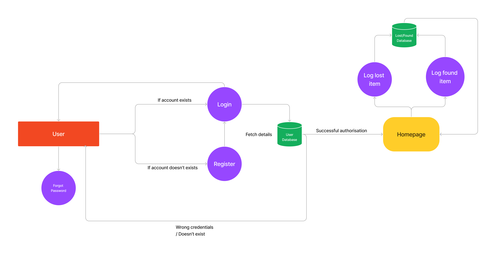

# FindIt - A university-centric lost and found web application

## Team Members

- Ahammed Jafar Saadique
- Mohammed Saheel A
- Manvi Khurana
- Ali Noori
- Rupinder Kaur

## Project Description

This is a web application where users can create an account using university email id and post items they have lost or found. The application will have a map view where users can see the location of the items posted by other users. Users can also search for items by category, location, and date. The application will also have a feature where users can report lost items to the university administration.

## Project Architecture

The project will be built using the MERN stack. The backend will be built using Node.js and Express.js. The frontend will be built using Nextjs. The database will be built using MongoDB. The application will be deployed on Vercel.

## Project Timeline

- Week 1: Project setup, database setup, and authentication
- Week 2: Map view, item posting, and item search
- Week 3: Item reporting, item filtering, and deployment

## Project Management

We will be using GitHub Projects to manage our project. We will have a project board for each sprint. Each sprint will have a set of issues that need to be completed. We will use the GitHub Projects Kanban board to track the progress of each issue. We will also use GitHub Issues to track bugs and feature requests.

## Project Website

Yet to be decided

### Data Flow Diagram

## Data Model

### User

- name: String
- email: String
- password: String
- items: [ObjectId]
- reports: [ObjectId]

### Item

- name: String
- category: String
- description: String
- location: String
- date: Date
- image: String
- user: ObjectId

### Report

- item: ObjectId
- user: ObjectId

## Wireframes

### Home Page

[https://www.figma.com/file/0Z0Q2Z0Z2Z0Z0Z0Z0Z0Z0Z/FindIt?node-id=0%3A1](https://www.figma.com/file/0Z0Q2Z0Z2Z0Z0Z0Z0Z0Z0Z/FindIt?node-id=0%3A1)

### Item Page

[https://www.figma.com/file/0Z0Q2Z0Z2Z0Z0Z0Z0Z0Z0Z/FindIt?node-id=0%3A1](https://www.figma.com/file/0Z0Q2Z0Z2Z0Z0Z0Z0Z0Z0Z/FindIt?node-id=0%3A1)

### Item Form

[https://www.figma.com/file/0Z0Q2Z0Z2Z0Z0Z0Z0Z0Z0Z/FindIt?node-id=0%3A1](https://www.figma.com/file/0Z0Q2Z0Z2Z0Z0Z0Z0Z0Z0Z/FindIt?node-id=0%3A1)

### Item Search

[https://www.figma.com/file/0Z0Q2Z0Z2Z0Z0Z0Z0Z0Z0Z/FindIt?node-id=0%3A1](https://www.figma.com/file/0Z0Q2Z0Z2Z0Z0Z0Z0Z0Z0Z/FindIt?node-id=0%3A1)

### Item Report

[https://www.figma.com/file/0Z0Q2Z0Z2Z0Z0Z0Z0Z0Z0Z/FindIt?node-id=0%3A1](https://www.figma.com/file/0Z0Q2Z0Z2Z0Z0Z0Z0Z0Z0Z/FindIt?node-id=0%3A1)

### Item Filter

[https://www.figma.com/file/0Z0Q2Z0Z2Z0Z0Z0Z0Z0Z0Z/FindIt?node-id=0%3A1](https://www.figma.com/file/0Z0Q2Z0Z2Z0Z0Z0Z0Z0Z0Z/FindIt?node-id=0%3A1)

## Project Schedule

### Week 1

- Project setup
- Database setup
- Authentication
- Map view
- Item posting
- Item search

### Week 2

- Item reporting
- Item filtering
- Deployment

### Week 3

- Deployment
- Project documentation